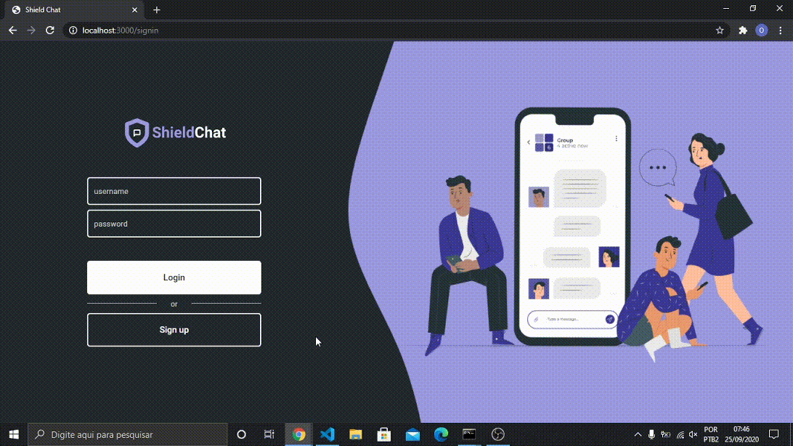

<h1 align="center">


</h1>



# How to run the application

## Backend setup
1. Create a file `.env`
2. Copy what is inside `.env.example` and paste in `.env`;
3. Fill the empty fields

    ```
      APP_PORT=3333

      ## auth

      AUTH_SECRET='randomPassword'

      ## database

      DB_USER='DatabaseUser'
      DB_PASSWORD='DatabasePassword'
      DATABASE='DatabaseName'
      DB_HOST='localhost'
      DB_PORT=5432
      DB_TYPE='postgres'
    ```

4. Open the terminal at the backend folder and type the command bellow to install the required packages:
    ```bash
    > yarn
    ```

5. Run all the migrations:
    ```bash
    > yarn typeorm migration:run
    ```

## Frontend setup
1. Open the terminal at the frontend folder and type the command bellow to install the required packages:
    ```bash
    > yarn
    ```

## Start application
1. In backend folder, type the command bellow to start the server:
    ```bash
    > yarn dev
    ```

2. In frontend folder, type the command bellow:
    ```bash
    > yarn start
    ```

# Tecnologies

- [Node.js](https://nodejs.org/en/)
- [React](https://pt-br.reactjs.org/)
- [TypeScript](https://www.typescriptlang.org/)
- [PostgreSQL](https://www.postgresql.org/)

# Author

<a href="https://github.com/DanielGustavo">
  
</a>

<p>Made by <a href="https://github.com/DanielGustavo"><b>Daniel Gustavo</b></a></p>

[](mailto:danielgustavo5205@gmail.com)
