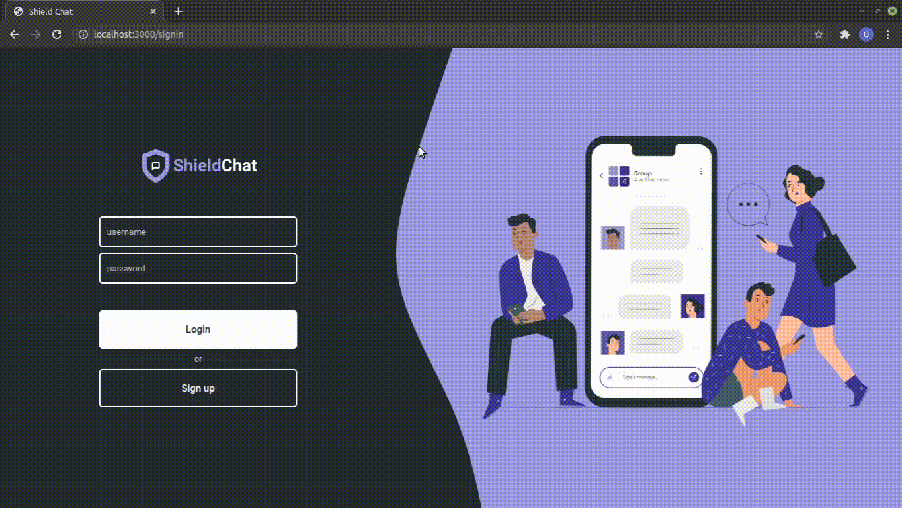

<h1 align="center">


</h1>



# Table of contents

<!--ts-->

- [Prerequisites](#Prerequisites)
- [How to run the application](#How-to-run-the-application)
  - [Backend setup](#Backend-setup)
  - [Frontend setup](#Frontend-setup)
  - [Mobile setup](#Mobile-setup)
  - [Start application](#Start-application)
- [Tecnologies](#Tecnologies)
- [Author](#Author)
<!--te-->

# Prerequisites

Before starting, you're gonna need to have [Docker](https://www.docker.com/get-started) (v19.03.0+) and [Expo](https://docs.expo.io/get-started/installation/) installed on your machine, and [Expo](https://play.google.com/store/apps/details?id=host.exp.exponent&hl=pt_BR&gl=US) installed on your smartphone. Besides that, a text editor like [VSCode](https://code.visualstudio.com/) is recommended.

# How to run the application

## Backend setup

1. Create a file `.env`
2. Copy what is inside `.env.example` and paste in `.env`;
3. If necessary, change the fields **_(Probably you won't have to do this, just if you want to)_**
4. Open the terminal at the backend folder and type the command bellow to install the required packages:
   ```bash
   > yarn
   ```
5. Open the terminal at the backend folder and type the command bellow to build the backend's and the database's containers:
   ```bash
   > docker-compose up --build -d
   ```
6. Run all the migrations:
   ```bash
   > docker exec shieldchat_backend yarn typeorm migration:run
   ```
7. Watch the backend's logs:
   ```bash
   > docker logs -f shieldchat_backend
   ```

## Frontend setup

1. Open the terminal at the frontend folder and type the command bellow to install the required packages:
   ```bash
   > yarn
   ```

## Mobile setup

1. Open the terminal at the mobile folder and type the command bellow to install the required packages:
   ```bash
   > yarn
   ```
2. Create a file `.env`
3. Copy what is inside `.env.example` and paste in `.env`, and change the fields as necessary

## Start application

1. To start the backend, you have to setup the containers first. Once they're configured, start the **shieldchat_db** container, then the **shieldchat_backend**:
   ```bash
   > docker start shieldchat_db
   ```
   ```bash
   > docker start shieldchat_backend
   ```
2. In frontend folder, type the command bellow:
   ```bash
   > yarn start
   ```
3. In mobile folder, type the command bellow:

   ```bash
   > yarn start
   ```

   If you want to change the fields in `.env` file after the first time, you have to start with the command bellow:

   ```bash
   > expo -c start
   ```

# Tecnologies

- [Node.js](https://nodejs.org/en/)
- [React](https://reactjs.org/)
- [React Native](https://reactnative.dev/)
- [Expo](https://docs.expo.io/get-started/installation/)
- [TypeScript](https://www.typescriptlang.org/)
- [PostgreSQL](https://www.postgresql.org/)
- [Docker](https://www.docker.com/)

# Author

<a href="https://github.com/DanielGustavo">
  
</a>

<p>Made by <a href="https://github.com/DanielGustavo"><b>Daniel Gustavo</b></a></p>

[](mailto:danielgustavo5205@gmail.com)
